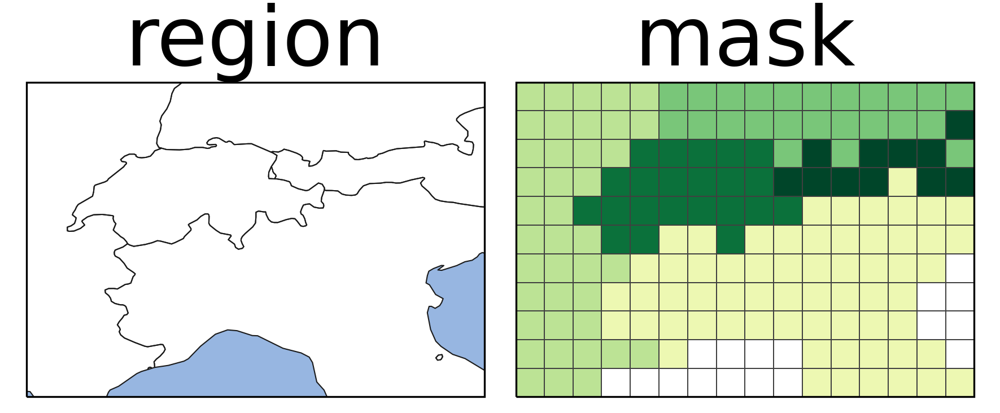

### 4CBLW020-Group-11
**Research Question**: How can data-driven estimates of police demand be used to inform the effective organisation and allocation of policing resources in the United Kingdom? 

**What was accomplished so far?**
Completed the data engineering pipeline to physically merge our 4.3 GB Crime dataset with 15 years of Met Office Weather data. We now have a unified, population-adjusted master dataset that is ready for AI predictive modeling and our midterm presentation.

**How it works?**
Data Compression: Used Polars to compress 95 million rows of Home Office crime data into a fast .parquet file, aggregating it to Total Crimes per Month per Police Force.

Geospatial Masking: Met Office weather data came in 3D 12km grid arrays (British National Grid). Used geopandas and regionmask to mathematically project our Police Force Shapefiles over the weather grid, calculating the exact Mean Temperature, Total Rainfall, and Total Sunshine for each Police Force Area. If you are wondering what happened here is the picture:

The fix for population: To prevent maps from just showing where people live (e.g., London always being the highest), I extracted Office for National Statistics (ONS) data, summed the age columns horizontally, and calculated the Crime Rate per 1,000 People thanks to Vlad's suggestion this morning.

Scope & Limitations (Why no Scotland/NI?): Note that our population data and maps are strictly limited to England and Wales. Statistical reporting in the UK is devolved. Northern Ireland and Scotland use completely different policing structures (e.g., Police Scotland is a single national force) and different population registries. Because our data is sourced from the Home Office and ONS, any maps will show Scotland and Northern Ireland as greyed out. If asked during the presentation, explain that we restricted our scope to maintain strict data integrity and avoid comparing mismatched legal systems.

**Important Files to Know (Shared in google drive)**
data/final_midterm_prototype_with_rates.csv -> This is our Master Dataset. It contains Month, Police Force, Mean Temp, Rainfall, Sunshine, Population, and Crime Rate. We will use this to train our predictive model for the dashboard. After obtaining tourism levels and free days, we will join the dataset.

outputs/Presentation Temperature/temperature_correlation_map.png -> The Red Map that shows how each police force area is affected by the change in temperature. If the Police Force area is in dark red, it means that it is highly correlated to the temperature.

outputs/Presentation Temperature/national_time_series_correlation.png -> The dual axis line chart. This essentially is a finding and a proof of feasibility for the subquestion of "Does temperature help explain fluctuations in selected crime types?". Where we see there is a big correlation.

**Presentation Talking Points**
Our specific sub-question is: "Does temperature help explain fluctuations in selected crime types?"

We can answer this with:

The Temporal Proof (Line Chart): Show the 5-year dual-axis chart. Explain that the national crime rate moves in perfect synchronization with the national temperature. Every summer it peaks; every winter it drops.

The Spatial Proof (Red Map): Show the correlation heatmap. Explain that we calculated the r (Pearson) correlation for all 43 forces. This proves the effect isn't uniform—coastal and tourist regions (Dark Red) are hyper-sensitive to heat compared to dense urban centers.

The Criminological Theory: We explain this using Routine Activity Theory (1979, Cohen & Felson). Heat doesn't biologically cause crime; it pushes people outdoors, floods tourist areas, and leaves homes empty with windows open. It mathematically increases "Suitable Targets" and decreases "Capable Guardians."

"Routine Activity Theory (Cohen & Felson, 1979) - Google it if you want to learn more about it.
For a crime to happen, you need an offender and a target in the same place at the same time. Weather dictates human routine. Rain keeps people indoors (lowering street crime, but maybe increasing domestic incidents). Sun brings people to parks and pubs (increasing public order offenses)" - This is the relevant literature/theory for this sub-problem. You could also tie this to tourism, as more hot weather, more tourists come etc.

**Feasibility for Final End Goal**
We present some of these plots as our Exploratory Data Analysis (EDA). By proving that temperature heavily correlates with crime, we prove to the examiners that our ultimate goal, an AI-driven Interactive Dashboard that forecasts crime based on upcoming weather reports, tourism and free-time is feasible and highly valuable for police resource allocation.